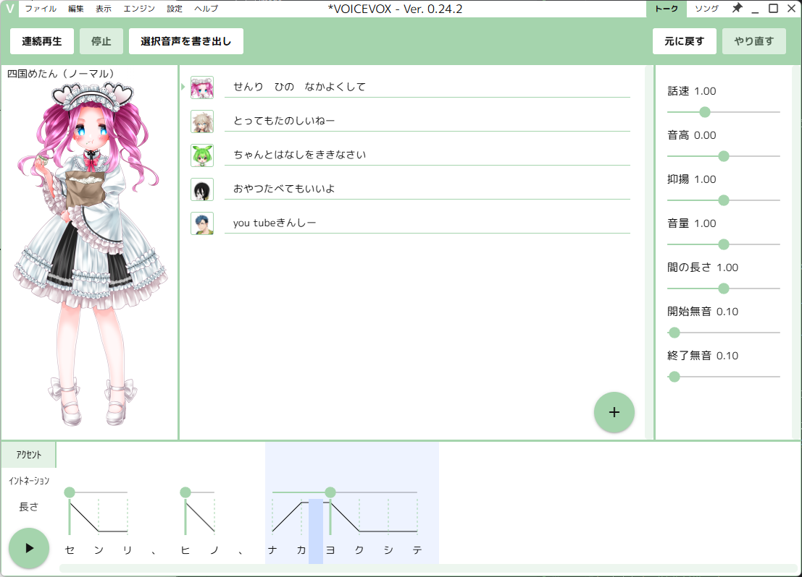
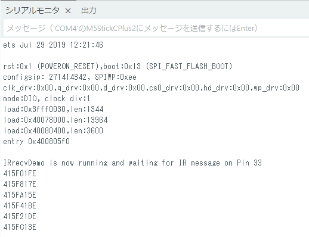
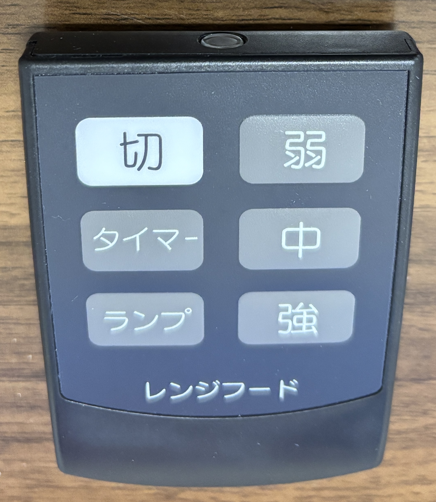

# m5stickc-plus2-ir-wav-player

家庭にあるような赤外線リモコンを使ってM5StickC Plus2を制御し、WAV形式の音声ファイルを再生するプロジェクトです。

## 概要

- **目的**: 赤外線リモコンを活用したマイコン制御の基礎を学ぶ。
- **背景**: 社内イベントでの制作品。
- **機能**: リモコンのボタン信号に応じて、M5StickC Plus2に保存された異なる音声ファイルを再生したり、LEDを制御したりします。

## 動作イメージ

IR（赤外線）センサーに向かってリモコンのボタンを押すと、対応する音声が再生されます。

| ボタン | 動作内容 | 発言内容 |
| :--- |:--- |:--- |
| **切** | 「切れた」旨の発言をします | `you tubeきんしー` |
| **弱** | 弱そうな発言をします | `とってもたのしいねー` |
| **タイマー** | 5秒後に発言します | `おやつたべてもいいよ` |
| **中** | 普通な発言をします | (音声なし) |
| **ランプ** | パネルが光り、発言します | `せんり　ひの　なかよくして` |
| **強** | 強そうな発言をします | `ちゃんとはなしをききなさい` |

## 必要なもの

### ハードウェア
- **マイコン**: [M5StickC Plus2](https://docs.m5stack.com/ja/core/M5StickC%20PLUS2)
- **IRセンサー**: M5GOキットなどに付属のIRユニット
  - M5StickC Plus2のGroveポート (G33) に接続します。
- **リモコン**: タカラスタンダード製レンジフード用リモコン (または任意のIRリモコン)

### ソフトウェア
- **Arduino IDE**:
  - **バージョン 2.x** (例: 2.3.2): スケッチのコンパイル・書き込み用
  - **バージョン 1.8.19**: 音声データ(SPIFFS)のアップロード用
- **ライブラリ**:
  - `M5StickCPlus2`
  - `IRremoteESP8266` (ver 2.8.6)
  - `ESP8266Audio`
- **音声関連ツール**:
  - [VOICEVOX](https://voicevox.hiroshiba.jp/): 音声合成
  - [Audacity](https://forest.watch.impress.co.jp/library/software/audacity/): 音声ファイル編集

## セットアップ手順

### 1. ハードウェアの接続
M5StickC Plus2のGroveポート（G33）にIRセンサーを接続します。

### 2. 音声ファイルの準備
M5StickC Plus2で再生するためのWAVファイルを作成します。

1.  **音声合成**: [VOICEVOX](https://voicevox.hiroshiba.jp/) を使って、各ボタンに対応するセリフの音声ファイルを作成します。
    
2.  **フォーマット変換**: [Audacity](https://forest.watch.impress.co.jp/library/software/audacity/) を使って、WAVファイルをM5StickC Plus2での再生に適した形式に変換します。
    - **再サンプリング**: メニューの `トラック` > `再サンプリング` で `8000` Hz を選択します。
    - **エクスポート**: メニューの `ファイル` > `オーディオをエクスポート` で以下の形式で保存します。
      - **フォーマット**: WAV (Microsoft)
      - **エンコーディング**: Unsigned 8-bit PCM
3.  **保存**: 変換したWAVファイルを、スケッチフォルダ内の `data` フォルダに保存します。

### 3. 開発環境の構築
Arduino IDEのセットアップとライブラリのインストールを行います。
2.x系と1.8.19系を共存させるため、1.8.19は**ポータブル版**を使用することを強く推奨します。

<details>
<summary><strong>詳細: Arduino IDE 1.8.19 (ポータブル版) のインストールと設定手順</strong></summary>

#### ステップ1: Arduino IDE 1.8.19 (ZIP版) のダウンロード
1.  [Arduino公式サイトのソフトウェアページ](https://www.arduino.cc/en/software)にアクセスします。
2.  ページ下部の「Legacy releases」セクションを探します。
3.  「Arduino IDE 1.8.19」の「**Windows ZIP file**」をクリックしてダウンロードします。

#### ステップ2: ZIPファイルの展開
1.  任意の場所（例: `C:\`）に `Arduino-1.8.19` という名前でフォルダを新規作成します。
2.  ダウンロードしたZIPファイルの中身を、すべてこのフォルダに展開します。

#### ステップ3: ポータブルモードの有効化
1.  展開先のフォルダ（例: `C:\Arduino-1.8.19`）の中に、`portable` という名前のフォルダを新規作成します。
    - これにより、このIDEに関する設定やライブラリがすべてこのフォルダ内に保存され、他のIDE環境から完全に独立します。

#### ステップ4: 開発環境セットアップ
1.  `C:\Arduino-1.8.19` 内の `arduino.exe` を起動します。
2.  **ボード定義の追加**:
    - `ファイル` > `環境設定` を開きます。
    - 「追加のボードマネージャのURL」に以下のURLを貼り付け、OKをクリックします。
      ```
      https://m5stack.oss-cn-shenzhen.aliyuncs.com/resource/arduino/package_m5stack_index.json
      ```
    - `ツール` > `ボード` > `ボードマネージャ` を開き、「M5Stack」で検索して**バージョン2.1.0**をインストールします。
3.  **ライブラリのインストール**:
    - `ツール` > `ライブラリを管理` から、以下のライブラリを検索してインストールします。
      - `M5StickCPlus2`
      - `IRremoteESP8266` (ver 2.8.6)
      - `ESP8266Audio`
4.  **SPIFFSアップロードツールの導入**:
    - [arduino-esp32fs-pluginのReleasesページ](https://github.com/me-no-dev/arduino-esp32fs-plugin/releases/)から最新版のZIPファイルをダウンロードします。
    - IDEのスケッチブックの場所（例: `C:\Arduino-1.8.19\portable\sketchbook`）に `tools` フォルダを新規作成します。
    - ダウンロードしたZIPを解凍し、中にある `ESP32FS` フォルダを、作成した `tools` フォルダ内にコピーします。
      - 最終的なパス: `...\sketchbook\tools\ESP32FS\tool\esp32fs.jar`
    - Arduino IDEを再起動します。
    - `ツール`メニューに「ESP32 Sketch Data Upload」が表示されていれば成功です。

</details>

### 4. 音声データのアップロード
1.  **Arduino IDE 1.8.19** を起動します。
2.  `ツール` > `Board` で「M5STICK-C-Plus2」を選択します。
3.  `ツール` メニューから `ESP32 Sketch Data Upload` を選択します。
4.  ダイアログが表示されたら `SPIFFS` を選び、OKをクリックしてアップロードを開始します。

### 5. スケッチの書き込み
1.  **Arduino IDE 2.x** を起動します。
2.  `m5stickc-plus2-ir-wav-player.ino` を開き、M5StickC Plus2に書き込みます。

## 使い方
1.  セットアップが完了したM5StickC Plus2を起動（リセット）します。
2.  IRセンサーに向かってリモコンのボタンを押すと、対応する動作が実行されます。

## (参考) 使用したリモコンの信号
本プロジェクトでは、タカラスタンダード製レンジフード用リモコンの信号を使用しました。
`IRrecvDemo.ino` スケッチを使えば、お使いのリモコンの信号を調べることができます。




| ボタン | 受信信号 (16進数) |
| :--- | :--- |
| **切** | `415F01FE` |
| **弱** | `415F817E` |
| **タイマー** | `415FA15E` |
| **中** | `415F41BE` |
| **ランプ** | `415F21DE` |
| **強** | `415FC13E` |
